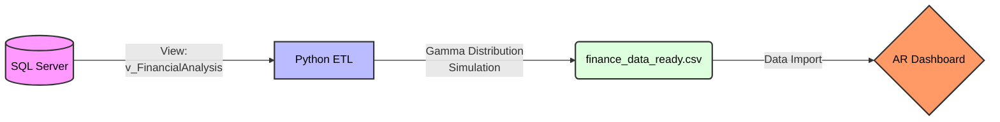

# Accounts Receivable & Sales Performance Analytics

## 📊 Project Overview
This project provides a full-stack solution for monitoring corporate financial health, specifically focusing on the relationship between Sales Performance and Cash Collection Efficiency. By integrating SQL Server, Python, and Power BI, the project transforms raw transaction data into actionable insights regarding liquidity and credit risk.

## 🛠️ Tech Stack

* **Database**: SQL Server (T-SQL) for data warehousing and view orchestration.
* **ETL & Data Science**: Python (Pandas, NumPy, SQLAlchemy) for realistic payment delay simulation and data transformation.
* **Visualization**: Power BI (DAX) for interactive dashboarding and KPI tracking.

## 🏗️ Data Pipeline & Architecture

### 1. SQL Server Layer (The Foundation)
* **Data Source:** Sourced from a refined **Star Schema** within the `AdventureWorks` database.
* **Production View:** Created `v_FinancialAnalysis` using **LEFT JOINs** to ensure 100% financial integrity, ensuring no sales records are lost even if dimension attributes are missing.
* **Data Cleaning:** Implemented `ISNULL` logic and string concatenation to prepare "clean" fields for the reporting layer.

### 2. Python Layer (The Simulation & ETL)
* **Data Simulation:** Developed a Python script to simulate realistic business behavior, addressing the lack of granular payment dates in standard databases.
* **Statistical Simulation:** Used a **Gamma Distribution** to generate realistic payment delays, creating a "long-tail" effect typical in B2B finance.
* **Feature Engineering:** Automated the calculation of **Aging Buckets** (On Time, 1-30 Days, etc.) and **DaysToPay**.
* **Error Handling:** The script includes a robust `try-except` structure and logging to handle SQL connection issues or file permission errors.

### 3. Power BI Layer (The Insights)
* **Analytics Dashboard:** Created a multi-dimensional dashboard to provide a comprehensive view of company performance and financial health.
* **DSO (Days Sales Outstanding):** Implemented a **3-Month Rolling Average** line to smooth out monthly volatility and reveal the true collection trend.
* **CEI (Collection Effectiveness Index):** A critical KPI measuring the quality of the collection process:
$$\text{CEI \%} = \left( \frac{\text{Current Collections}}{\text{Total Billable Amount}} \right) \times 100$$
* **Dynamic UX:** Features synchronized slicers and **Conditional Formatting** on the Gauge chart to immediately signal if YTD sales are lagging behind the previous year.

<p align="center">
  
  <br>
  <i>Interactive Power BI Dashboard: Analyzing DSO and Collection Effectiveness Index (CEI)</i>
</p>

## 📈 Key Insights Captured
* Aging Breakdown: Identifies that while 80% of debt is "1-30 Days Late," the CEI remains high, suggesting a stable but slightly delayed cash inflow.
* Regional Trends: Users can filter by Country (e.g., United States, Australia) to see how collection efficiency varies by market.
* Target Achievement: The Gauge visual provides an "at-a-glance" status of current YTD sales vs. targets, using semantic colors (Red/Green) for instant interpretation.

## 🚀 How to Run

Follow these steps to deploy and run the full ETL pipeline and reporting dashboard:

### 1. SQL Server Setup
* **Database Requirement:** Ensure you have the `AdventureWorksDW` sample database installed.
* **View Creation:** Navigate to the `/sql` directory and execute the `v_FinancialAnalysis.sql` script in **SQL Server Management Studio (SSMS)**. This script creates the core view with the necessary `LEFT JOIN` and data cleaning logic.

### 2. Python Environment & ETL Process
* **Install Dependencies:** Open your terminal and install the required libraries using the provided file:
  `pip install -r requirements.txt`
* **Execute ETL:** Run the `financial_analysis.ipynb` notebook located in the `/python` folder. This will:
    * Connect to your local SQL Server instance.
    * Apply the **Gamma Distribution simulation** for payment delays.
    * Generate and save the final dataset to `data/finance_data_ready.csv`.

### 3. Power BI Visualization
* **Open Report:** Launch the `AR_Dashboard.pbix` file from the `/power-bi` directory.
* **Data Refresh:** Click the **Refresh** button in the Power BI ribbon to pull the latest data from the CSV file.
    * *Note:* You may need to update the Data Source settings to point to the exact local path of your `finance_data_ready.csv`.

## 🗺️ Project Logic & Data Flow


## 📂 Repository Structure
```
Accounts-Receivable-Sales-Performance-Analytics/
├── data/                       # Storage for processed datasets
│   └── finance_data_ready.csv  # Final dataset generated by Python
├── sql/                        # SQL transformation scripts
│   └── v_FinancialAnalysis.sql # View definition with LEFT JOIN logic
├── python/                     # ETL and Simulation logic
│   └── financial_analysis.ipynb # Jupyter Notebook with Gamma simulation
├── power-bi/                   # Visualization layer
│   └── AR_Dashboard.pbix       # Final Power BI report file
├── README.md                   # Main project overview and instructions
├── requirements.txt            # Python dependencies (pandas, sqlalchemy, etc.)
```
